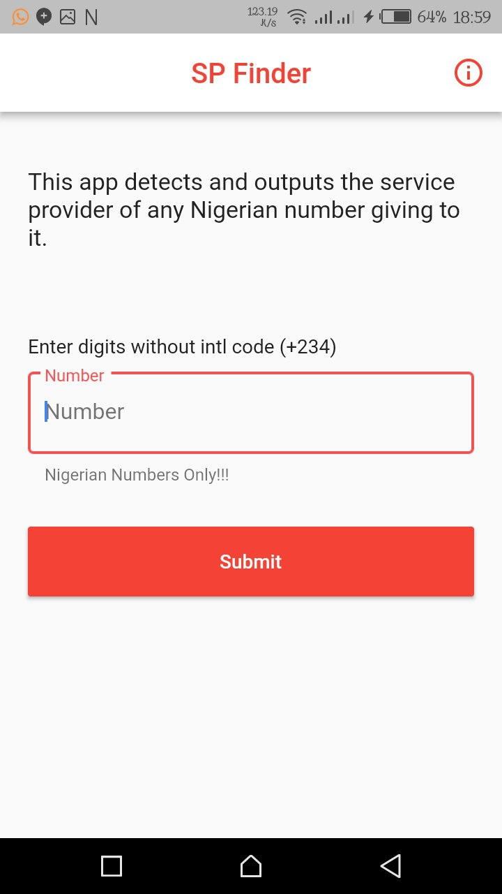
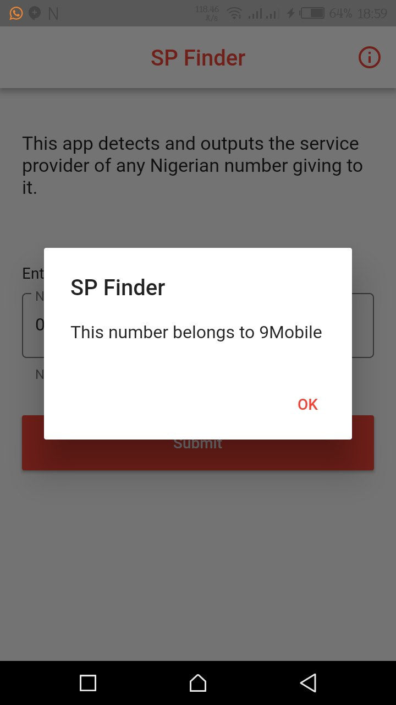
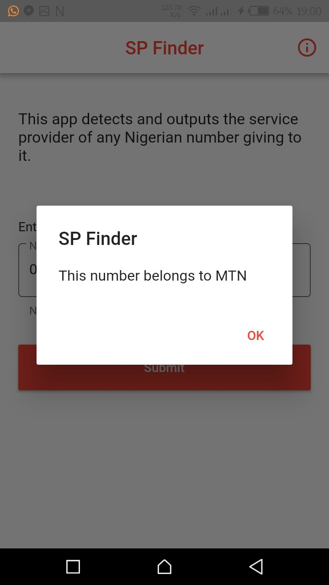
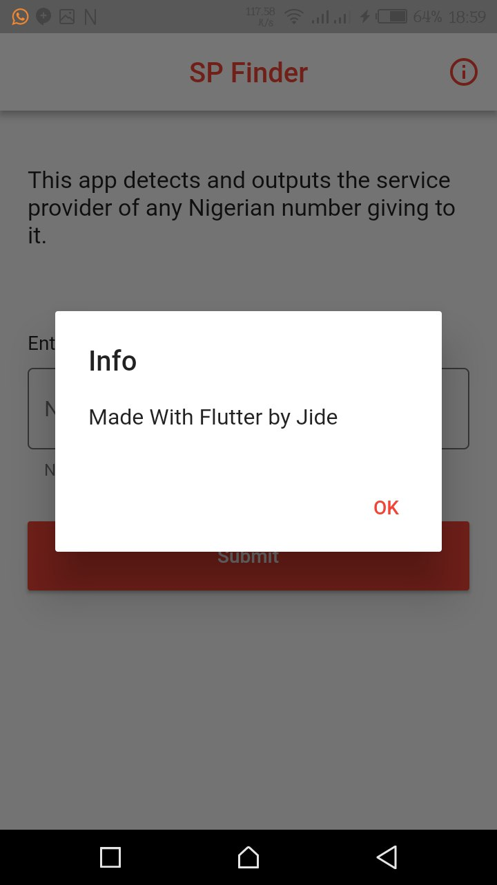

# SP FInder

A Flutter application that detects network of any Nigerian number


# Why?

I made this project for people beginning **Flutter** so they can gain one or two things.


# ScreenShots




# Requirements
* Any Operating System (ie. MacOS X, Linux, Windows)
* Any IDE with flutter IDE installed (ie. IntelliJ, Android Studio, VSCode etc)
* A little knowledge of Dart
* A brain to think 🤓🤓


# Author(s)
**Olusegun Festus Babajide**


# Contributors
**Error 404**


# License
```
Copyright [2018] [JideGuru]

Licensed under the Apache License, Version 2.0 (the "License");
you may not use this file except in compliance with the License.
You may obtain a copy of the License at

    http://www.apache.org/licenses/LICENSE-2.0

Unless required by applicable law or agreed to in writing, software
distributed under the License is distributed on an "AS IS" BASIS,
WITHOUT WARRANTIES OR CONDITIONS OF ANY KIND, either express or implied.
See the License for the specific language governing permissions and
limitations under the License.
```

# Disclaimer
This code is only intended for learning purposes, i am not responsible for anything you use it for.

Pardon my Bad English 😔

Enjoy if you like what you see😃